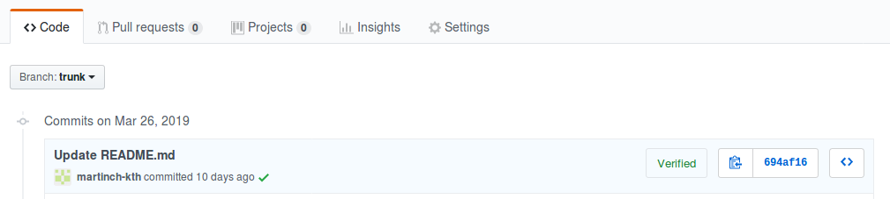

Build status for dhell project, just trying out icon:

# jenkins-descartes-plugin
A Jenkins plugin to run PIT / Descartes analysis and store the data 
[Descartes](https://github.com/STAMP-project/pitest-descartes) is an open source tool to detect pseudo-tested methods in Java code.

A detailed explanation about pseudo-tested methods and what kind of
issues they reveal in a test suite is available in this [article](https://softwarediversity.eu/beaune.pdf)

An initial PoC to demonstrate the Github check API with the analysis of pseudo-tested methods on each pull request is [available](https://github.com/STAMP-project/descartes-github-app)

---------------------------

Descartes GitHub App - User guide

1)  -   Log into your github account.    
Install GitHub App https://github.com/apps/descartes-github-app

2) Test if the GitHub app works correctly by doing these steps:

Make a small change in the readme file below, then save+commit it 
https://github.com/castor-software/spoon-mirror/blob/master/README.md

This triggers a Jenkins build on the KTH server, please hold on for 2:30 hours while spoon is build and tested. http://130.237.59.170:8080 is the Jenkins server, user/pwd admin/admin if you want to see current status)

3) 2:30 hours later. You should now see a green checkmark in commits:
https://github.com/castor-software/spoon-mirror/commits/master

Like this:

Click the green checkmark, a pop-up window will appear ->

Click the ‘Details’ link to see commit result ->

There is also a calendar displaying partially tested results for each commit:

Troubleshot:

If the build fails, or a commit does not contain a green checkmark/link to the commit result, you could check build status in Jenkins: http://130.237.59.170:8080/  

Then check the console output of the job called ‘test’.

